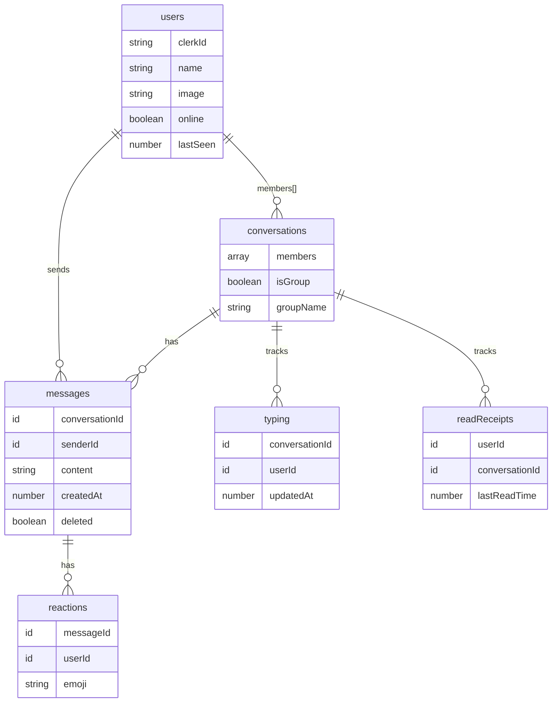
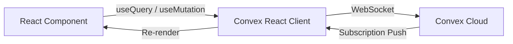

<div align="center">
  <h1>💬 TarsChat</h1>
  <p><strong>A modern, real-time messaging application built with Next.js, Convex, and Clerk.</strong></p>

  <p>
    
    
    
    
    
    
  </p>
</div>

---

## ✨ Features

| Feature | Description |
|---|---|
| 🔐 **Authentication** | Sign-in / sign-up via Clerk (social + email) with protected routes |
| 💬 **1-on-1 Chat** | Start a direct conversation with any user in one click |
| 👥 **Group Chat** | Create named group conversations with multiple members |
| ⚡ **Real-Time Messaging** | Messages appear instantly via Convex subscriptions — no polling |
| ✍️ **Typing Indicators** | See who is currently typing with auto-expiry (3 s) |
| 😀 **Emoji Reactions** | Toggle reactions (👍 ❤️ 😂 😮 😢) on any message |
| 🗑️ **Soft-Delete Messages** | Delete your own messages — shown as "This message was deleted" |
| 🔢 **Unread Counts** | Per-conversation badge with unread message count |
| ✅ **Read Receipts** | Mark conversations as read; accurate unread tracking |
| 📜 **Paginated History** | Load older messages on demand via cursor-based pagination |
| 🟢 **Presence** | Online / offline status with "last seen" timestamps |
| 🔍 **Search** | Filter conversations and users in the sidebar instantly |
| 📱 **Responsive** | Mobile-first layout — sidebar on small screens, split view on desktop |
| 🛡️ **Error Handling** | Error boundary + toast notifications + input retry UI |

---

## 🛠️ Tech Stack

| Layer | Technology |
|---|---|
| **Framework** | [Next.js 16](https://nextjs.org) (App Router, React Server Components) |
| **UI** | [React 19](https://react.dev), [TailwindCSS 4](https://tailwindcss.com), [shadcn/ui (New York)](https://ui.shadcn.com) |
| **Backend / Database** | [Convex](https://convex.dev) — real-time BaaS (queries, mutations, subscriptions) |
| **Auth** | [Clerk](https://clerk.com) — hosted auth with user management |
| **Icons** | [Lucide React](https://lucide.dev) |
| **Toasts** | [React Hot Toast](https://react-hot-toast.com) |
| **Textarea** | [react-textarea-autosize](https://github.com/Andarist/react-textarea-autosize) |
| **Language** | [TypeScript 5](https://www.typescriptlang.org) |

---

## 📂 Project Structure

```
tars-chat/
│
├── convex/                      # Convex backend (serverless functions + schema)
│   ├── schema.ts                # Database schema (6 tables)
│   ├── users.ts                 # User sync & online status mutations/queries
│   ├── conversations.ts         # Conversation CRUD & enriched listing
│   ├── messages.ts              # Send, delete, paginate messages + read receipts
│   ├── reactions.ts             # Emoji reaction toggle + per-conversation fetch
│   ├── typing.ts                # Real-time typing indicator management
│   └── _generated/              # Auto-generated Convex client code
│
├── src/                         # Frontend & Business Logic
│   ├── app/                     # Next.js App Router (pages, layout, globals)
│   │   ├── layout.tsx           # Root layout: Clerk + Convex providers
│   │   ├── page.tsx             # Landing / login page
│   │   ├── globals.css          # Global styles & design tokens
│   │   ├── chat/                # Sidebar & empty state views
│   │   └── conversation/        # Active chat windows [id]
│   │
│   ├── components/              # Reusable UI Components
│   │   ├── ChatSidebar.tsx      # Sidebar navigation & lists
│   │   ├── ChatWindow.tsx       # Message feed & header
│   │   ├── MessageBubble.tsx    # WhatsApp-style bubble with reactions
│   │   ├── MessageInput.tsx     # Textarea & typing logic
│   │   ├── ConversationList.tsx # Active chat items
│   │   ├── UserList.tsx         # User directory for DMs
│   │   ├── SearchBar.tsx        # Search interface
│   │   ├── NewGroupModal.tsx    # Group creation interface
│   │   ├── ErrorBoundary.tsx    # Safety net for UI crashes
│   │   └── providers/           # Context providers
│   │
│   ├── lib/                     # Utilities & Constants
│   │   ├── utils.ts             # CN, formatters, truncation
│   │   └── convexClient.ts      # Shared backend client
│   │
│   └── proxy.ts                 # Clerk middleware — route protection

├── public/                      # Static assets & assets
│
├── package.json
├── tsconfig.json
├── next.config.ts
├── postcss.config.mjs
├── eslint.config.mjs
├── components.json              # shadcn/ui configuration
└── .gitignore
```

---

## 🗄️ Database Schema

TarsChat uses **Convex** as its real-time database. The schema is defined in [`convex/schema.ts`](convex/schema.ts) and contains six tables:



---

## 🚀 Getting Started

### Prerequisites

- **Node.js** ≥ 18
- **npm** (or pnpm / yarn)
- A free [Clerk](https://clerk.com) account
- A free [Convex](https://convex.dev) account

### 1. Clone the repository

```bash
git clone https://github.com/vedbhadani/TarsChat.git
cd tars-chat
```

### 2. Install dependencies

```bash
npm install
```

### 3. Configure environment variables

Create a `.env.local` file in the project root:

```env
# Clerk
NEXT_PUBLIC_CLERK_PUBLISHABLE_KEY=pk_test_...
CLERK_SECRET_KEY=sk_test_...

# Convex
CONVEX_DEPLOYMENT=dev:<your-deployment-name>
NEXT_PUBLIC_CONVEX_URL=https://<your-deployment>.convex.cloud
```

> [!TIP]
> The Convex variables are automatically set when you run `npx convex dev` for the first time.

### 4. Start the Convex dev server

```bash
npx convex dev
```

This pushes your schema and functions to Convex and starts watching for changes.

### 5. Start the Next.js dev server

In a **separate terminal**:

```bash
npm run dev
```

Open [http://localhost:3000](http://localhost:3000) — you should see the TarsChat landing page.

---

## 📜 Available Scripts

| Script | Command | Description |
|---|---|---|
| **dev** | `npm run dev` | Start Next.js in development mode |
| **build** | `npm run build` | Create a production build |
| **start** | `npm run start` | Serve the production build |
| **lint** | `npm run lint` | Run ESLint across the codebase |

---

## 🎨 Design System

TarsChat uses a **warm earthy palette** inspired by premium craftsmanship:

| Token | Value | Usage |
|---|---|---|
| **Primary** | `#B5784A` | Buttons, active states, accents |
| **Primary Hover** | `#8F5A32` | Darkened primary for hover states |
| **Background** | `#F2EDE4` | Page backgrounds |
| **Surface** | `#FFFFFF` | Cards, modals, inputs |
| **Surface Alt** | `#FAF7F2` | Input backgrounds |
| **Border** | `#E8E0D4` | Borders and dividers |
| **Text Primary** | `#1A1208` | Headings, body text |
| **Text Secondary** | `#7A6A56` | Labels, placeholders |
| **Text Muted** | `#B0A090` | Hints, timestamps |
| **Success** | `#34C759` | Online indicators |
| **Error** | `#EF4444` | Error states |

**Typography:** [Plus Jakarta Sans](https://fonts.google.com/specimen/Plus+Jakarta+Sans) via `next/font`.

---

## 🔒 Authentication & Authorization

- **Provider:** [Clerk](https://clerk.com) — handles sign-in, sign-up, session management, and user profiles.
- **Middleware:** [`src/middleware.ts`](#) protects `/chat` and `/conversation` routes. The landing page (`/`) is public.
- **User Sync:** On login, the `createUserIfNotExists` mutation syncs the Clerk user to the Convex `users` table (upsert pattern).

---

## 🔄 Real-Time Architecture



1. **Queries** (`useQuery`) subscribe to Convex and automatically re-render when data changes.
2. **Mutations** (`useMutation`) write data; all subscribed clients receive updates instantly.
3. **Typing indicators** use a write-then-expire pattern — the `typing` table records are auto-filtered by a 3-second window.

---

## 🧩 Key Components

| Component | Responsibility |
|---|---|
| **`ChatSidebar`** | Tabbed sidebar (Users / Chats), search, group modal, online presence sync |
| **`ChatWindow`** | Message feed with pagination, header with user info, typing indicator bar |
| **`MessageBubble`** | Single message display with grouping, reactions, delete, read receipt |
| **`MessageInput`** | Auto-resizing textarea, send mutations, typing indicator debounce |
| **`ConversationList`** | Enriched conversation list with last message, unread count, avatar |
| **`UserList`** | All users list with online status, click to start a DM |
| **`NewGroupModal`** | Multi-select user picker + group name to create group chats |
| **`SearchBar`** | Controlled / uncontrolled search input with clear button |
| **`ErrorBoundary`** | Catches rendering errors with a recovery UI |

---

## 🌐 Deployment

### Vercel (Recommended)

1. Push to GitHub.
2. Import the repo on [Vercel](https://vercel.com/new).
3. Add the environment variables from `.env.local` to the Vercel project settings.
4. Deploy — Vercel auto-detects Next.js.

### Convex Production

```bash
npx convex deploy
```

This deploys your Convex functions to a production instance. Update `NEXT_PUBLIC_CONVEX_URL` accordingly.

<div align="center">
  <strong>Built with ❤️ using Next.js, Convex, and Clerk</strong>
</div>

